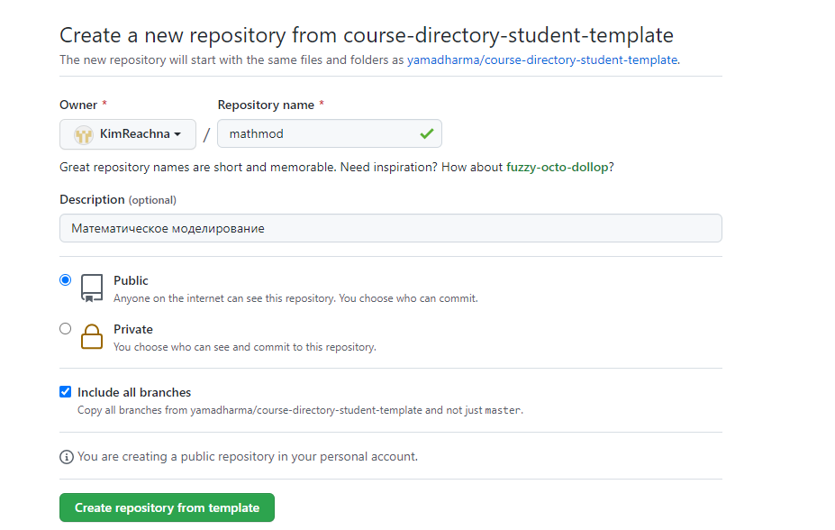
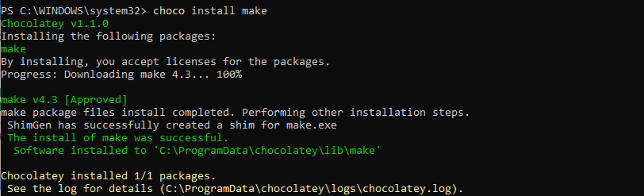
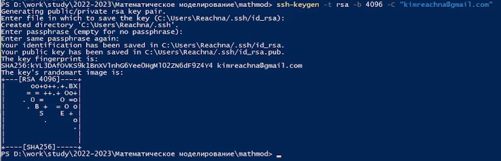
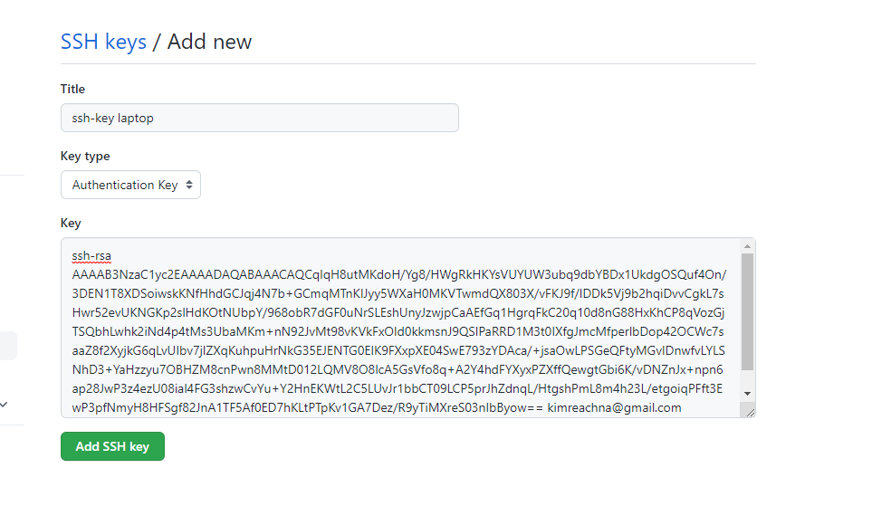
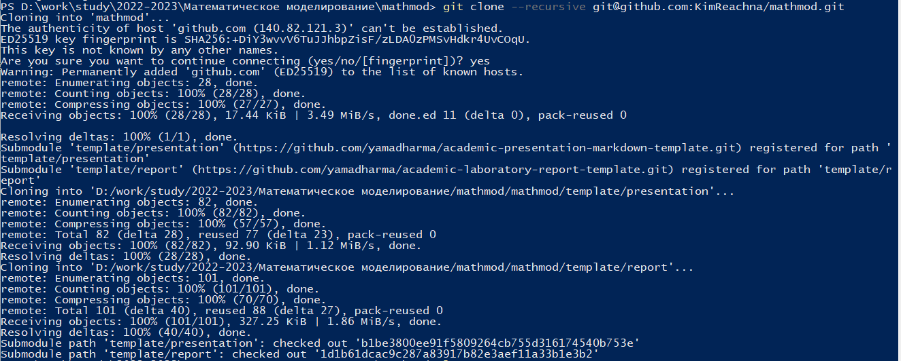
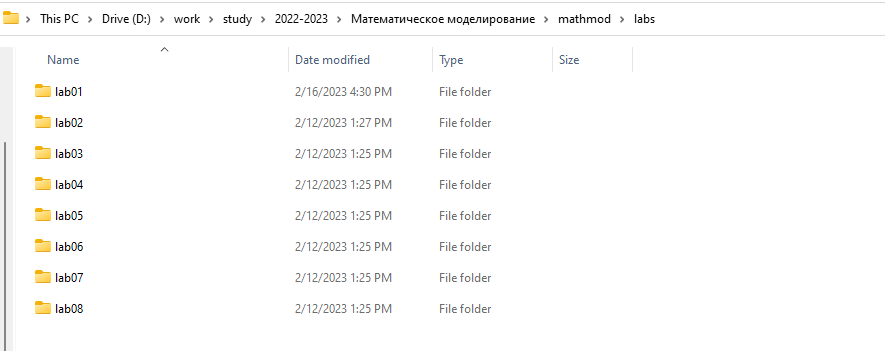
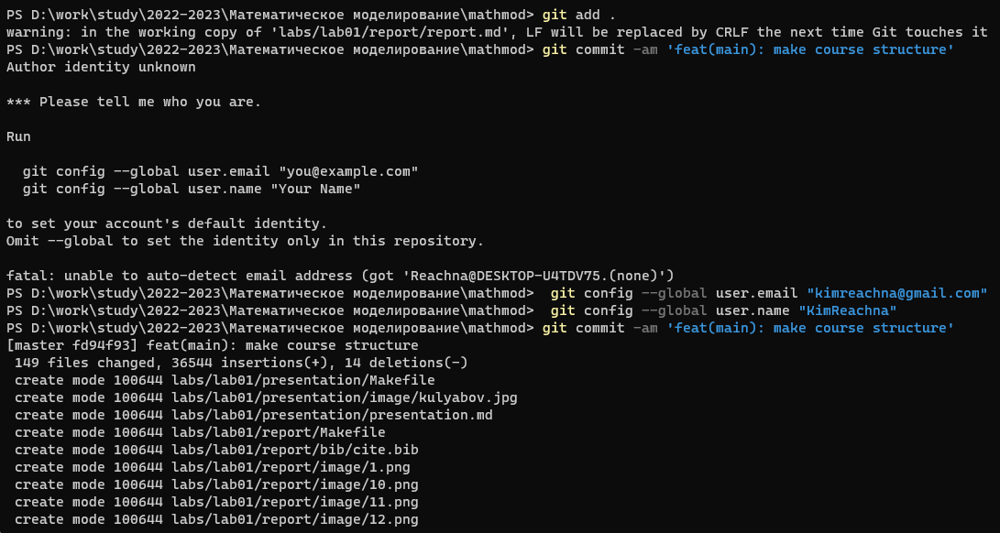
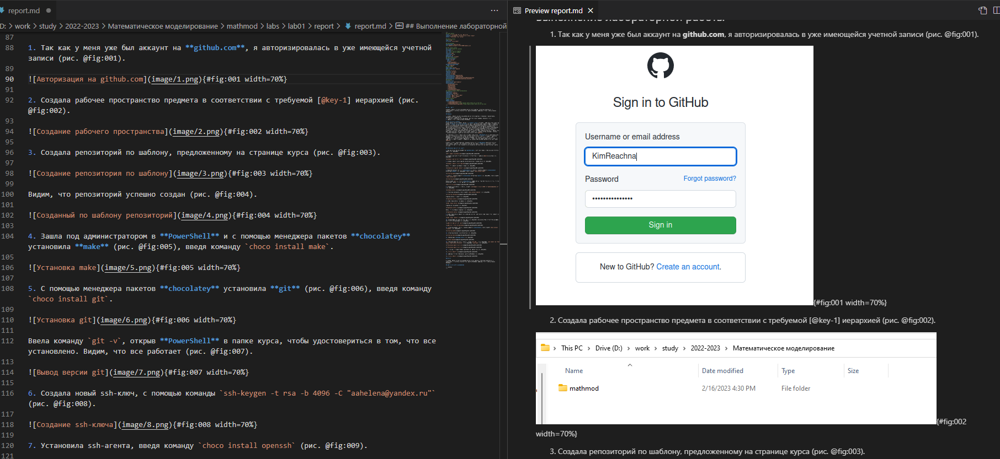

---
## Front matter
lang: ru-RU
title: Лабораторная работа №1
subtitle: Подготовка репозитория. Работа с markdown.
author:
  - Ким Реачна
institute:
  - Российский университет дружбы народов, Москва, Россия
date: 16 февраля 2023

## i18n babel
babel-lang: russian
babel-otherlangs: english

## Formatting pdf
toc: false
toc-title: Содержание
slide_level: 2
aspectratio: 169
section-titles: true
theme: metropolis
header-includes:
 - \metroset{progressbar=frametitle,sectionpage=progressbar,numbering=fraction}
 - '\makeatletter'
 - '\beamer@ignorenonframefalse'
 - '\makeatother'
---

# Информация

## Докладчик

:::::::::::::: {.columns align=center}
::: {.column width="70%"}

  * Ким Реачна
  * студент группы НПИбд-02-20
  * Российский университет дружбы народов
  * [1032205204@pfur.ru](1032205204@pfur.ru)
  * <https://github.com/KimReachna>

:::
::: {.column width="30%"}

:::
::::::::::::::

# Вводная часть

## Актуальность

- Необходим навык работы с репозиториями
- Для обозначения форматирования в простом тексте, с максимальным сохранением его читаемости человеком, для создания продвинутых публикаций необходим навык работы на Markdown
- Необходимо создавать презентацию быстро
- Желательна минимизация усилий для создания презентации

## Объект и предмет исследования

- GitHub как служба размещения в Интернете репозиториев Git
- Язык разметки Markdown
- Входные и выходные форматы отчетов

## Цели и задачи

- Создать репозиторий курса на github.com на основе шаблона и соглашений о наименовании, описанных на странице курса
- Написать отчет с использованием Markdown

## Материалы и методы

- Служба размещения в Интернете репозиториев GiеHub
- Процессор `pandoc` для входного формата Markdown
- Результирующие форматы
	- `pdf`
	- `docs`

# Выполнение работы

## Создание репозитория

Создаем с помощью шаблона

{width=70%}

## Установка необходимых пакетов

Были установлены make, pandoc, openssh, git с помощью chocolaney
Также был установлен texlive с помощью установщика

{width=70%}

## Генерация SSH-ключа

{width=70%}

## Добавление ключа на GitHub

{width=70%}

## Клонирование репозитория

Для клонирования используем скопированный ssh из репозитория

{width=70%}

## Создание каталогов для лабораторных работ

В каждый каталог помещены папки для отчета и презентации

{width=70%}

## Отправка файлов на сервер

Команды: 

`git add .` 

`git commit -am 'feat(main): make course structure'` 

`git push`

{width=70%}

## Написание отчета

Использую Markdown

{width=70%}

# Результаты

## Результат

- Создан репозиторий курса на github.com на основе шаблона и соглашений о наименовании, описанных на странице курса
- Установлены необходимые для дальнейшей работы программы (pandoc, texlive и т.д.)
- Написан отчет с использованием Markdown

# Вывод

## Вывод

Я создала репозиторий курса на github.com на основе шаблона. Установила необходимое ПО. Ознакомилась с основными возможностями разметки Markdown. Написала отчет с использованием Markdown.