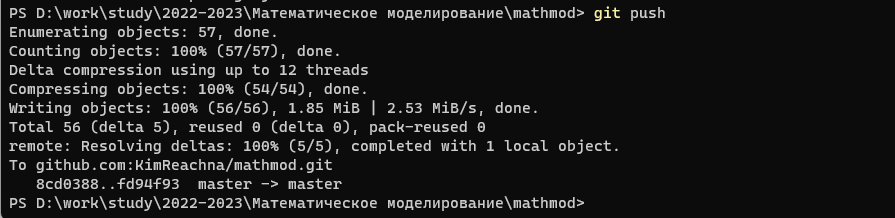

---
## Front matter
title: "Отчет по лабораторной работе №1"
subtitle: "Дисциплина: Математическое моделирование"
author: "Выполнила:  Кеан Путхеаро"

## Generic otions
lang: ru-RU
toc-title: "Содержание"

## Bibliography
bibliography: bib/cite.bib
csl: pandoc/csl/gost-r-7-0-5-2008-numeric.csl

## Pdf output format
toc: true # Table of contents
toc-depth: 2
lof: true # List of figures
lot: true # List of tables
fontsize: 12pt
linestretch: 1.5
papersize: a4
documentclass: scrreprt
## I18n polyglossia
polyglossia-lang:
  name: russian
  options:
	- spelling=modern
	- babelshorthands=true
polyglossia-otherlangs:
  name: english
## I18n babel
babel-lang: russian
babel-otherlangs: english
## Fonts
mainfont: PT Serif
romanfont: PT Serif
sansfont: PT Sans
monofont: PT Mono
mainfontoptions: Ligatures=TeX
romanfontoptions: Ligatures=TeX
sansfontoptions: Ligatures=TeX,Scale=MatchLowercase
monofontoptions: Scale=MatchLowercase,Scale=0.9
## Biblatex
biblatex: true
biblio-style: "gost-numeric"
biblatexoptions:
  - parentracker=true
  - backend=biber
  - hyperref=auto
  - language=auto
  - autolang=other*
  - citestyle=gost-numeric
## Pandoc-crossref LaTeX customization
figureTitle: "Рис."
tableTitle: "Таблица"
listingTitle: "Листинг"
lofTitle: "Список иллюстраций"
lotTitle: "Список таблиц"
lolTitle: "Листинги"
## Misc options
indent: true
header-includes:
  - \usepackage{indentfirst}
  - \usepackage{float} # keep figures where there are in the text
  - \floatplacement{figure}{H} # keep figures where there are in the text
---

## Цель работы

Создание репозитория курса на github.com на основе шаблона. Установка необходимого ПО. Ознакомление с основными возможностями разметки Markdown. Написание отчета с использованием Markdown.

## Задание

1. Создать репозиторий курса на github.com на основе шаблона и соглашений о наименовании, описанных на странице курса.
2. Установить необходимые для дальнейшей работы программы (pandoc, texlive и т.д.).
3. Написать отчет с использованием Markdown.

## Теоретическое введение
В ходе данного курса мы будем работать с **репозиторием** и выгружать результаты своей работы на github. **Репозиторий или проект GIT** включает в себя полный набор файлов и папок, связанных с проектом, а также журнал изменений каждого файла. Журнал файла представлен в виде моментальных снимков на определенные моменты времени. Эти снимки называются фиксациями. Фиксации можно упорядочивать по нескольким линиям разработки, называемым ветвями. Так как GIT — распределенная система управления версиями, репозитории являются автономными единицами и любой пользователь, имеющий копию репозитория, может получать доступ ко всей базе кода и ее истории. С помощью командной строки или других удобных интерфейсов возможны также следующие действия с репозиторием GIT: взаимодействие с журналом, клонирование репозитория, создание ветвей, фиксация, слияние, сравнение изменений в разных версиях кода и многое другое [@key-2].

Для выполнения отчетов в данном курсе мы будем использовать **Markdown** — это облегченный язык разметки с синтаксисом форматирования обычного текста. Несмотря на то, что файлы с разметкой Markdown имеют собственный формат .md или .markdown, они содержат только текст и могут создаваться в любых программах типа Блокнот.  Однако, его можно без проблем конвертировать и в гипертекст, и даже в документ с визуальным оформлением (RTF или DOC) без потери форматирования [@key-3].

В данном отчете я также использую выделение текста, которое **Markdown** позволяет довольно легко сделать. Например, для выделения слова курсивом нужно с обеих сторон обрамить текст символами "*" или "_". Для выделения жирным необходимо поставить по два таких символа с каждой стороны. 

## Выполнение лабораторной работы

1. Так как у меня уже был аккаунт на **github.com**, я авторизировалась в уже имеющейся учетной записи (рис. @fig:001).

{#fig:001 width=70%}

2. Создала рабочее пространство предмета в соответствии с требуемой [@key-1] иерархией (рис. @fig:002).

{#fig:002 width=70%}

3. Создала репозиторий по шаблону, предложенному на странице курса (рис. @fig:003).

{#fig:003 width=70%}

Видим, что репозиторий успешно создан (рис. @fig:004).

{#fig:004 width=70%}

4. Зашла под администратором в **PowerShell** и с помощью менеджера пакетов **chocolatey** установила **make** (рис. @fig:005), введя команду `choco install make`.

{#fig:005 width=70%}

5. С помощью менеджера пакетов **chocolatey** установила **git** (рис. @fig:006), введя команду `choco install git`.

{#fig:006 width=70%}

Ввела команду `git -v`, открыв **PowerShell** в папке курса, чтобы удостовериться в том, что все установлено. Видим, что все работает (рис. @fig:007).

{#fig:007 width=70%}

6. Создала новый ssh-ключ, с помощью команды `ssh-keygen -t rsa -b 4096 -C "aahelena@yandex.ru"` (рис. @fig:008).

{#fig:008 width=70%}

7. Установила ssh-агента, введя команду `choco install openssh` (рис. @fig:009).

{#fig:009 width=70%}

Добавила ssh-ключ в агент (рис. @fig:010).

{#fig:010 width=70%}

8. Скопировала ssh-ключ из файла (рис. @fig:011).

{#fig:011 width=70%}

Добавила его на github (рис. @fig:012).

{#fig:012 width=70%}

Видим, что все успешно добавлено (рис. @fig:013).

{#fig:013 width=70%}

9. Скопировала ssh из репозитория и использую его для рекурсивного копирования этого репозитория (рис. @fig:014).

{#fig:014 width=70%} 

10. Создала папки для лабораторных работ (рис. @fig:015) и перенесла туда соответствующие папки для отчетов и презентаций (рис. @fig:016).

{#fig:015 width=70%} 

{#fig:016 width=70%}

11. Установила pandoc с помощью менеджера пакетов **chocolatey**, введя команду `choco install -y pandoc` (рис. @fig:017).

{#fig:017 width=70%} 

12. Установила texlive через установщик (рис. @fig:018).

{#fig:018 width=70%}

13. Удалила файл **package.json** (рис. @fig:019).

{#fig:019 width=70%}  

14. Отправила файлы на сервер с помощью команд `git add .` (рис. @fig:020), `git commit -am 'feat(main): make course structure'` (рис. @fig:020), `git push` (рис. @fig:021).

{#fig:020 width=70%} 

{#fig:021 width=70%} 

15. Проверила, что файлы успешно загружены на репозиторий (рис. @fig:022).
 
{#fig:022 width=70%} 

16. Написала отчет по выполненной работе на Markdown (рис. @fig:023)
 
{#fig:023 width=70%} 

## Выводы

Я создала репозиторий курса на github.com на основе шаблона. Установила необходимое ПО. Ознакомилась с основными возможностями разметки Markdown. Написала отчет с использованием Markdown.

## Список литературы{.unnumbered}

::: {#refs}
:::
